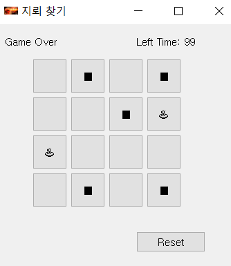

# MineSweep Game


## 1. Install Requirements
```
> pip install -r requirements.txt
```

### Optional > Update Requirements
```
> pip freeze > requirements.txt
```

## 2. Run game
```
> python mine_game.py
```